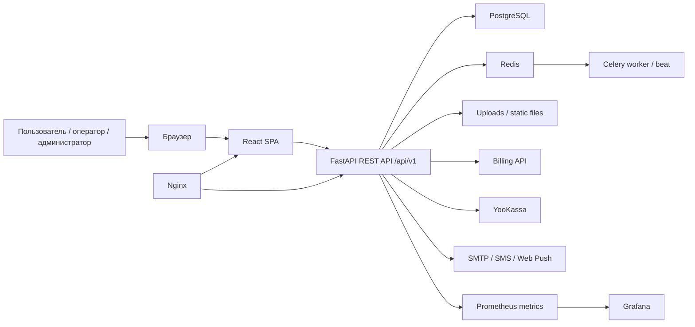
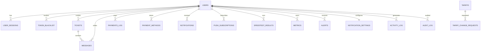

# Приложение К — материалы веб-приложения MTN

Файл подготовлен как исходный пакет данных для оформления приложения к дипломной работе. Его можно передать другой нейросети или использовать вручную при верстке раздела "Приложение К — Материалы веб-приложения React/FastAPI, Docker Compose, структура БД, API, скриншоты интерфейса".

Дата подготовки: 27 апреля 2026 г.
Рабочая папка проекта: `C:\Users\ADMIN\Desktop\webapp-deepseek\app`

Важно для оформления:

- Не публиковать реальные токены, пароли, ключи, значения `SECRET_KEY`, `JWT_SECRET_KEY`, `POSTGRES_PASSWORD`, `REDIS_PASSWORD`, `YKASSA_SECRET_KEY`, `SMS_API_KEY`, `SMTP_PASSWORD` и аналогичные секреты.
- В тексте диплома можно указывать только имена переменных окружения и назначение сервисов.
- Скриншоты для приложения уже собраны в папку `appendix_k_assets`.

## Готовое задание для нейросети-оформителя

Оформи приложение к дипломной работе на русском языке: "Приложение К — Материалы веб-приложения React/FastAPI, Docker Compose, структура БД, API, скриншоты интерфейса". Используй данные ниже. Сделай академичный стиль, аккуратные таблицы, подписи к рисункам и листингам. Не раскрывай секретные значения переменных окружения, используй только названия переменных. Сохрани структуру: назначение приложения, технологический стек, структура проекта, Docker Compose, структура базы данных, API, маршруты интерфейса, скриншоты, команды запуска и проверки.

## 1. Назначение веб-приложения

Веб-приложение MTN представляет собой личный кабинет телеком-оператора Martin Telecom Network. Система предназначена для абонентов, операторов поддержки и администраторов. Приложение предоставляет единый интерфейс для авторизации, просмотра состояния услуг, управления тарифами, платежей, обращений в поддержку, уведомлений, статистики, проверки скорости соединения и мониторинга качества сервиса.

Архитектура построена как SPA-клиент на React и серверная часть на FastAPI. Клиент взаимодействует с сервером через REST API, а сервер использует PostgreSQL для хранения данных, Redis для кэширования и очередей, Celery для фоновых задач, Nginx для проксирования и отдачи статических файлов, Prometheus/Grafana для мониторинга в production-контуре.

## 2. Технологический стек

| Уровень | Используемые технологии |
| --- | --- |
| Frontend | React 18.3.1, TypeScript, Vite 8, React Router 7, TanStack Query, Zustand, Axios, React Hook Form, Zod, Framer Motion, lucide-react |
| Backend | Python 3.12, FastAPI 0.104.1, Uvicorn, Gunicorn, SQLAlchemy 2.0, Alembic, Pydantic 2, python-jose, passlib/bcrypt |
| База данных | PostgreSQL 16, asyncpg, Alembic migrations |
| Очереди и фоновые задачи | Redis 7, Celery |
| Инфраструктура | Docker, Docker Compose, Nginx, Prometheus, Grafana |
| Интеграции | YooKassa, SMTP, SMS provider, Web Push, Sentry, billing API |
| Тестирование и качество | Pytest, Ruff, Black, isort, mypy, ESLint, TypeScript typecheck |

## 3. Общая архитектура



Ключевые особенности:

- SPA-клиент выполняется в браузере и получает данные через API.
- Все основные API-методы сгруппированы под префиксом `/api/v1`.
- Авторизация построена на access/refresh JWT-токенах.
- Для ролей используются пользовательские, операторские и административные контуры.
- Платежи, уведомления, мониторинг и служебные операции вынесены в отдельные backend-модули.
- Celery используется для задач, которые не должны блокировать HTTP-запросы.
- Production-окружение дополняется Prometheus и Grafana.

## 4. Структура проекта

```text
app/
  app/
    api/
      v1/
        endpoints/          # REST API endpoints
        router.py           # объединение API-маршрутов
    alembic/                # миграции БД
    core/                   # безопасность, middleware, логирование
    middleware/             # метрики, maintenance и другие middleware
    models/                 # SQLAlchemy-модели
    schemas/                # Pydantic-схемы запросов/ответов
    services/               # бизнес-логика и интеграции
    static/                 # статические файлы backend
    templates/              # HTML-шаблоны
    tests/                  # backend-тесты
    utils/                  # вспомогательные функции
    workers/                # Celery worker/beat
    config.py               # настройки приложения
    database.py             # подключение к БД
    dependencies.py         # зависимости FastAPI
    main.py                 # точка входа FastAPI
  frontend/
    src/
      app/                  # роутер и приложение
      components/           # UI-компоненты
      hooks/                # React hooks
      pages/                # страницы приложения
      services/             # API-клиент и сервисы
      store/                # Zustand store
      styles/               # глобальные стили
      types/                # TypeScript-типы
      utils/                # утилиты frontend
    package.json
    vite.config.ts
  docker/                   # конфигурации Nginx, Prometheus, Grafana
  deploy/                   # deployment-скрипты
  scripts/                  # вспомогательные скрипты
  tests/                    # интеграционные и e2e-тесты
  docker-compose.yml        # development compose
  docker-compose.prod.yml   # production compose
  Dockerfile                # development/runtime image
  Dockerfile.prod           # production image
  requirements.txt          # Python-зависимости
  pyproject.toml            # конфигурация Python-инструментов
```

## 5. Docker Compose

### 5.1 Development-контур

Файл: `C:\Users\ADMIN\Desktop\webapp-deepseek\app\docker-compose.yml`

| Сервис | Образ / сборка | Назначение |
| --- | --- | --- |
| `postgres` | `postgres:16-alpine` | Основная база данных приложения |
| `redis` | `redis:7-alpine` | Кэш, брокер очередей и служебное хранилище |
| `app` | build `Dockerfile` | FastAPI-приложение, запуск через `uvicorn` с reload |
| `celery_worker` | build `Dockerfile` | Выполнение фоновых задач Celery |
| `celery_beat` | build `Dockerfile` | Планировщик периодических задач Celery |
| `nginx` | `nginx:alpine` | Reverse proxy и отдача статических файлов |

Основные особенности development-окружения:

- Backend доступен на порту `8000`.
- Nginx доступен на порту `80`.
- PostgreSQL и Redis запускаются с healthcheck.
- Код backend монтируется в контейнер для разработки.
- Включены demo-режим и автоматическая синхронизация схемы.

Переменные окружения, используемые в development-контуре:

```text
PYTHONPATH
ENVIRONMENT
POSTGRES_HOST
POSTGRES_PORT
POSTGRES_USER
POSTGRES_PASSWORD
POSTGRES_DB
REDIS_HOST
REDIS_PORT
DEBUG
DEMO_MODE
DEMO_SHOW_SMS_CODE
AUTO_SCHEMA_SYNC
RELOAD
PUBLIC_APP_URL
SECRET_KEY
JWT_SECRET_KEY
BILLING_API_KEY
SMS_PROVIDER
YKASSA_TEST_MODE
```

### 5.2 Production-контур

Файл: `C:\Users\ADMIN\Desktop\webapp-deepseek\app\docker-compose.prod.yml`

| Сервис | Образ / сборка | Назначение |
| --- | --- | --- |
| `postgres` | `postgres:16-alpine` | Production-база данных с отдельным volume и backup-каталогом |
| `redis` | `redis:7-alpine` | Redis с паролем, AOF и ограничением памяти |
| `app` | build `Dockerfile.prod` | Production FastAPI-приложение под Gunicorn |
| `celery_worker` | build `Dockerfile.prod` | Фоновая обработка задач |
| `celery_beat` | build `Dockerfile.prod` | Планировщик периодических задач |
| `nginx` | `nginx:alpine` | HTTP/HTTPS reverse proxy |
| `prometheus` | `prom/prometheus:latest` | Сбор метрик |
| `grafana` | `grafana/grafana:latest` | Визуализация мониторинга |

Переменные окружения production-контура:

```text
APP_VERSION
POSTGRES_USER
POSTGRES_PASSWORD
POSTGRES_DB
REDIS_PASSWORD
SECRET_KEY
JWT_SECRET_KEY
BILLING_API_KEY
BILLING_API_URL
PUBLIC_APP_URL
YKASSA_SHOP_ID
YKASSA_SECRET_KEY
YKASSA_WEBHOOK_SECRET
YKASSA_RETURN_URL
STRIPE_SECRET_KEY
STRIPE_PUBLISHABLE_KEY
SMTP_HOST
SMTP_PORT
SMTP_USER
SMTP_PASSWORD
SMTP_FROM
SMS_PROVIDER
SMS_API_URL
SMS_API_KEY
WEBPUSH_VAPID_PUBLIC_KEY
WEBPUSH_VAPID_PRIVATE_KEY
WEBPUSH_VAPID_SUBJECT
SENTRY_DSN
CELERY_WORKER_CONCURRENCY
GRAFANA_PASSWORD
GRAFANA_ROOT_URL
```

### 5.3 Dockerfile

Файл: `C:\Users\ADMIN\Desktop\webapp-deepseek\app\Dockerfile`

Назначение:

- базовый образ `python:3.12-slim`;
- установка системных библиотек для PostgreSQL и обработки файлов;
- установка зависимостей из `requirements.txt`;
- создание непривилегированного пользователя `appuser`;
- создание каталогов `uploads`, `logs`, `static`;
- публикация порта `8000`;
- запуск приложения через Gunicorn.

Файл production-сборки: `C:\Users\ADMIN\Desktop\webapp-deepseek\app\Dockerfile.prod`

Особенности production-сборки:

- multi-stage build;
- отдельный runtime-слой;
- healthcheck через `/health`;
- запуск под непривилегированным пользователем;
- использование Gunicorn-конфигурации.

## 6. Структура базы данных

Модели расположены в каталоге: `C:\Users\ADMIN\Desktop\webapp-deepseek\app\app\models`

Миграции Alembic расположены в каталоге: `C:\Users\ADMIN\Desktop\webapp-deepseek\app\app\alembic\versions`

Основные миграции:

- `001_initial_migration.py` — первичная схема.
- `002_spec_alignment.py` — выравнивание схемы под спецификацию.
- `003_monitoring_module.py` — модуль мониторинга.
- `004_notification_center.py` — центр уведомлений.

### 6.1 ER-диаграмма



### 6.2 Таблицы базы данных

| Таблица | Назначение | Ключевые поля |
| --- | --- | --- |
| `users` | Пользователи, абоненты, операторы и администраторы | `id`, `billing_id`, `phone`, `email`, `password_hash`, `avatar_url`, `first_name`, `last_name`, `role`, `is_active`, `is_verified`, `is_blocked`, `totp_secret`, `is_2fa_enabled`, `created_at`, `last_login_at`, `notification_settings` |
| `user_sessions` | Активные пользовательские сессии | `id`, `user_id`, `token`, `refresh_token`, `ip_address`, `user_agent`, `device_info`, `created_at`, `expires_at`, `last_activity_at`, `is_revoked` |
| `token_blacklist` | Отозванные JWT-токены | `id`, `token`, `token_type`, `user_id`, `revoked_at`, `expires_at`, `reason` |
| `tariffs` | Тарифные планы | `id`, `billing_tariff_id`, `name`, `speed_mbps`, `upload_speed_mbps`, `price`, `setup_fee`, `is_unlimited`, `traffic_limit_gb`, `description`, `features`, `is_active`, `is_popular`, `sort_order` |
| `tariff_change_requests` | Заявки на смену тарифа | `id`, `user_id`, `old_tariff_id`, `new_tariff_id`, `status`, `error_message`, `requested_at`, `processed_at`, `effective_from`, `ip_address` |
| `payments_log` | История платежей | `id`, `user_id`, `amount`, `fee_amount`, `net_amount`, `payment_method`, `payment_type`, `status`, `external_id`, `payment_url`, `gateway_response`, `description`, `created_at`, `completed_at` |
| `payment_methods` | Сохраненные способы оплаты | `id`, `user_id`, `method_type`, `token`, `masked_pan`, `card_type`, `expiry_month`, `expiry_year`, `is_default`, `is_active`, `created_at` |
| `tickets` | Обращения в поддержку | `id`, `user_id`, `assigned_to`, `subject`, `category`, `status`, `priority`, `sla_deadline`, `escalated_at`, `first_response_at`, `resolved_at`, `closed_at`, `satisfaction_rating`, `metadata`, `tags` |
| `messages` | Сообщения в обращениях | `id`, `ticket_id`, `user_id`, `body`, `is_internal`, `attachment_path`, `attachment_name`, `attachment_size`, `attachment_mime`, `created_at`, `edited_at` |
| `notifications` | Уведомления пользователя | `id`, `user_id`, `title`, `body`, `type`, `priority`, `event_type`, `category`, `is_read`, `is_archived`, `is_sent`, `sent_at`, `read_at`, `expires_at`, `action_url`, `metadata` |
| `notification_templates` | Шаблоны уведомлений | `id`, `name`, `type`, `subject_template`, `body_template`, `is_active`, `created_at`, `updated_at` |
| `push_subscriptions` | Подписки браузера на push-уведомления | `id`, `user_id`, `endpoint`, `p256dh_key`, `auth_key`, `user_agent`, `created_at`, `last_used_at`, `is_active` |
| `speedtest_results` | Результаты проверки скорости | `id`, `user_id`, `download_mbps`, `upload_mbps`, `ping_ms`, `ip_address`, `user_agent`, `server_meta`, `created_at` |
| `metrics` | Метрики качества соединения | `id`, `user_id`, `ping_ms`, `packet_loss_pct`, `jitter_ms`, `download_mbps`, `upload_mbps`, `source`, `route_snapshot`, `collected_at` |
| `alerts` | События и предупреждения мониторинга | `id`, `user_id`, `type`, `severity`, `status`, `metric_name`, `message`, `start_time`, `end_time`, `is_read`, `current_value`, `threshold_value`, `duration_minutes`, `details` |
| `notification_settings` | Настройки уведомлений мониторинга | `user_id`, `monitoring_enabled`, `site_enabled`, `email_enabled`, `telegram_enabled`, `browser_push_enabled`, `enabled_event_types`, `quiet_hours_start`, `quiet_hours_end`, `alert_cooldown_minutes` |
| `alert_thresholds` | Пороговые значения мониторинга | `id`, `metric_name`, `condition`, `warning_value`, `critical_value`, `warning_duration_minutes`, `critical_duration_minutes`, `is_active`, `created_at`, `updated_at` |
| `activity_log` | Журнал действий пользователей | `id`, `user_id`, `action`, `action_type`, `ip_address`, `user_agent`, `resource_type`, `resource_id`, `old_value`, `new_value`, `status`, `error_message`, `created_at` |
| `audit_log` | Аудиторский журнал операций | `id`, `user_id`, `entity_type`, `entity_id`, `operation`, `changes`, `ip_address`, `user_agent`, `reason`, `requires_retention`, `created_at` |

## 7. API

Основной префикс API: `/api/v1`

Дополнительные маршруты:

- `/health` — краткая проверка состояния приложения.
- `/metrics` — Prometheus metrics endpoint.
- `/ws` — WebSocket endpoint, включается в зависимости от профиля запуска.
- `/admin/metrics` — HTML-страница администрирования метрик.

### 7.1 Сводная таблица API

| Группа | Endpoint | Метод | Назначение |
| --- | --- | --- | --- |
| Health | `/api/v1/health/` | GET | Базовая проверка состояния API |
| Health | `/api/v1/health/detailed` | GET | Детальная проверка зависимостей |
| Health | `/api/v1/health/readiness` | GET | Readiness probe |
| Health | `/api/v1/health/liveness` | GET | Liveness probe |
| Auth | `/api/v1/auth/login` | POST | Вход пользователя |
| Auth | `/api/v1/auth/2fa/login` | POST | Вход с двухфакторной аутентификацией |
| Auth | `/api/v1/auth/refresh` | POST | Обновление access/refresh token |
| Auth | `/api/v1/auth/register` | POST | Регистрация пользователя |
| Auth | `/api/v1/auth/register/confirm` | POST | Подтверждение регистрации |
| Auth | `/api/v1/auth/logout` | POST | Выход из системы |
| Auth | `/api/v1/auth/change-password` | POST | Смена пароля |
| Auth | `/api/v1/auth/reset-password` | POST | Сброс пароля |
| Auth | `/api/v1/auth/2fa/setup` | POST | Настройка 2FA |
| Auth | `/api/v1/auth/2fa/verify` | POST | Подтверждение 2FA |
| Auth | `/api/v1/auth/2fa/disable` | POST | Отключение 2FA |
| Users | `/api/v1/users/me` | GET | Получение профиля текущего пользователя |
| Users | `/api/v1/users/me` | PUT | Обновление профиля |
| Users | `/api/v1/users/me/avatar` | POST | Загрузка аватара |
| Users | `/api/v1/users/me/sessions` | GET | Список сессий |
| Users | `/api/v1/users/me/sessions/{session_id}` | DELETE | Завершение выбранной сессии |
| Users | `/api/v1/users/me/change-email` | POST | Запрос смены email |
| Users | `/api/v1/users/me/verify-email` | POST | Подтверждение email |
| Users | `/api/v1/users/me/sessions/logout-all` | POST | Завершение всех сессий |
| Tariffs | `/api/v1/tariffs/` | GET | Список тарифов |
| Tariffs | `/api/v1/tariffs/compare` | GET | Сравнение тарифов |
| Tariffs | `/api/v1/tariffs/{tariff_id}` | GET | Детали тарифа |
| Tariffs | `/api/v1/tariffs/change` | POST | Заявка на смену тарифа |
| Tariffs | `/api/v1/tariffs/history` | GET | История смены тарифов |
| Payments | `/api/v1/payments/create` | POST | Создание платежа |
| Payments | `/api/v1/payments/{payment_id}/confirm-demo` | POST | Demo-подтверждение платежа |
| Payments | `/api/v1/payments/{payment_id}/refresh` | POST | Обновление статуса платежа |
| Payments | `/api/v1/payments/{payment_id}/retry` | POST | Повтор платежа |
| Payments | `/api/v1/payments/history` | GET | История платежей |
| Payments | `/api/v1/payments/statement/pdf` | GET | Выписка в PDF |
| Payments | `/api/v1/payments/methods` | GET/POST | Получение и добавление способов оплаты |
| Payments | `/api/v1/payments/{payment_id}` | GET | Детали платежа |
| Payments | `/api/v1/payments/methods/{method_id}` | DELETE | Удаление способа оплаты |
| Payments | `/api/v1/payments/refund` | POST | Возврат платежа |
| Tickets | `/api/v1/tickets` | GET/POST | Список обращений и создание обращения |
| Tickets | `/api/v1/tickets/{ticket_id}` | GET | Детали обращения |
| Tickets | `/api/v1/tickets/{ticket_id}/reply` | POST | Ответ в обращении |
| Tickets | `/api/v1/tickets/{ticket_id}/resolve` | POST | Закрытие обращения как решенного |
| Tickets | `/api/v1/tickets/{ticket_id}/rate` | POST | Оценка обращения |
| Tickets | `/api/v1/tickets/{ticket_id}/close` | POST | Закрытие обращения |
| Notifications | `/api/v1/notifications` | GET | Список уведомлений |
| Notifications | `/api/v1/notifications/unread/count` | GET | Количество непрочитанных |
| Notifications | `/api/v1/notifications/{notification_id}/read` | POST | Отметить уведомление прочитанным |
| Notifications | `/api/v1/notifications/bulk/read` | POST | Массовое чтение |
| Notifications | `/api/v1/notifications/read-all` | POST | Отметить все прочитанными |
| Notifications | `/api/v1/notifications/{notification_id}/archive` | POST | Архивировать уведомление |
| Notifications | `/api/v1/notifications/settings` | GET/PUT | Настройки уведомлений |
| Notifications | `/api/v1/notifications/events/types` | GET | Типы событий уведомлений |
| Notifications | `/api/v1/notifications/subscribe/push` | POST/DELETE | Управление push-подпиской |
| Statistics | `/api/v1/statistics/traffic` | GET | Статистика трафика |
| Statistics | `/api/v1/statistics/payments` | GET | Статистика платежей |
| Statistics | `/api/v1/statistics/tickets` | GET | Статистика обращений |
| Statistics | `/api/v1/statistics/admin/dashboard` | GET | Сводка для административной панели |
| Speedtest | `/api/v1/speedtest/session` | POST/DELETE | Управление speedtest-сессией |
| Speedtest | `/api/v1/speedtest/ping` | GET | Измерение ping |
| Speedtest | `/api/v1/speedtest/download` | GET | Тест загрузки |
| Speedtest | `/api/v1/speedtest/upload` | POST | Тест отдачи |
| Speedtest | `/api/v1/speedtest/run` | POST | Полный тест скорости |
| Speedtest | `/api/v1/speedtest/history` | GET | История тестов |
| Speedtest | `/api/v1/speedtest/stats` | GET | Сводная статистика speedtest |
| Monitoring | `/api/v1/monitoring/metrics` | GET | Метрики мониторинга |
| Monitoring | `/api/v1/monitoring/alerts` | GET | Предупреждения мониторинга |
| Monitoring | `/api/v1/monitoring/alerts/{alert_id}/read` | POST | Отметить предупреждение прочитанным |
| Monitoring | `/api/v1/monitoring/summary` | GET | Сводка мониторинга |
| Monitoring | `/api/v1/monitoring/subscribe` | GET/POST | Подписка на мониторинг |
| Billing | `/api/v1/billing/balance` | GET | Баланс пользователя |
| Billing | `/api/v1/billing/tariff` | GET | Текущий тариф из billing-контура |
| Search | `/api/v1/search/global` | GET | Глобальный поиск |
| Search | `/api/v1/search/users` | GET | Поиск пользователей |
| Webhooks | `/api/v1/webhook/yookassa` | POST | Webhook YooKassa |
| Webhooks | `/api/v1/webhook/payment` | POST | Платежный webhook |
| Admin | `/api/v1/admin/dashboard` | GET | Административная сводка |
| Admin | `/api/v1/admin/users` | GET/POST | Управление пользователями |
| Admin | `/api/v1/admin/users/{user_id}` | GET/PATCH | Детали и изменение пользователя |
| Admin | `/api/v1/admin/users/{user_id}/block` | POST | Блокировка пользователя |
| Admin | `/api/v1/admin/users/{user_id}/unblock` | POST | Разблокировка пользователя |
| Admin | `/api/v1/admin/tickets` | GET | Список обращений для оператора/админа |
| Admin | `/api/v1/admin/tickets/{ticket_id}` | GET | Детали обращения |
| Admin | `/api/v1/admin/tickets/{ticket_id}/assign` | POST | Назначение оператора |
| Admin | `/api/v1/admin/tickets/{ticket_id}/reply` | POST | Ответ оператора |
| Admin | `/api/v1/admin/tickets/{ticket_id}/resolve` | POST | Решение обращения |
| Admin | `/api/v1/admin/staff` | GET/POST | Управление персоналом |
| Admin | `/api/v1/admin/staff/{staff_id}` | GET/PUT | Детали и изменение сотрудника |
| Admin | `/api/v1/admin/activity-log` | GET | Журнал действий |
| Admin | `/api/v1/admin/logs` | GET | Системные логи |
| Admin | `/api/v1/admin/system/info` | GET | Информация о системе |
| Admin | `/api/v1/admin/system/settings` | GET/PUT | Системные настройки |
| Admin | `/api/v1/admin/cache/clear` | POST | Очистка кэша |
| Admin | `/api/v1/admin/maintenance` | POST | Режим обслуживания |

## 8. Frontend-маршруты

Файл роутера: `C:\Users\ADMIN\Desktop\webapp-deepseek\app\frontend\src\app\router.tsx`

| Маршрут | Страница | Доступ |
| --- | --- | --- |
| `/` | LandingPage | Публичный |
| `/login` | LoginPage | Только гость |
| `/register` | RegisterPage | Только гость |
| `/recover` | RecoveryPage | Только гость |
| `/dashboard` | DashboardPage | Авторизованный пользователь |
| `/tariffs` | TariffsPage | Авторизованный пользователь |
| `/payments` | PaymentsPage | Авторизованный пользователь |
| `/support` | SupportPage | Авторизованный пользователь |
| `/support/:ticketId` | TicketDetailPage | Авторизованный пользователь |
| `/notifications` | NotificationsPage | Авторизованный пользователь |
| `/statistics` | StatisticsPage | Авторизованный пользователь |
| `/speedtest` | SpeedtestPage | Авторизованный пользователь |
| `/monitoring` | MonitoringPage | Авторизованный пользователь |
| `/profile` | ProfilePage | Авторизованный пользователь |
| `/settings` | SettingsPage | Авторизованный пользователь |
| `/admin/dashboard` | AdminDashboardPage | Оператор / администратор |
| `/admin/users` | AdminUsersPage | Оператор / администратор |
| `/admin/users/:userId` | AdminUserDetailPage | Оператор / администратор |
| `/admin/tickets` | AdminTicketsPage | Оператор / администратор |
| `/admin/payments` | AdminPaymentsPage | Администратор / super admin |
| `/admin/tariffs` | AdminTariffsPage | Администратор / super admin |
| `/admin/operators` | AdminOperatorsPage | Администратор / super admin |
| `/admin/settings` | AdminSettingsPage | Администратор / super admin |
| `*` | NotFoundPage | Любой пользователь |

## 9. Скриншоты интерфейса

Папка со скриншотами: `C:\Users\ADMIN\Desktop\webapp-deepseek\app\appendix_k_assets`

| Номер рисунка | Файл | Подпись |
| --- | --- | --- |
| Рисунок К.1 | `appendix_k_assets/K01_landing_page.png` | Стартовая страница веб-приложения MTN |
| Рисунок К.2 | `appendix_k_assets/K02_login_page_desktop.png` | Страница входа в личный кабинет на desktop-разрешении |
| Рисунок К.3 | `appendix_k_assets/K03_login_page_mobile.png` | Адаптивная версия страницы входа на мобильном устройстве |
| Рисунок К.4 | `appendix_k_assets/K04_dashboard.png` | Главная страница личного кабинета пользователя |
| Рисунок К.5 | `appendix_k_assets/K05_payments.png` | Раздел платежей и истории операций |
| Рисунок К.6 | `appendix_k_assets/K06_support.png` | Раздел обращений в техническую поддержку |
| Рисунок К.7 | `appendix_k_assets/K07_notifications.png` | Центр уведомлений пользователя |
| Рисунок К.8 | `appendix_k_assets/K08_statistics.png` | Раздел пользовательской статистики |
| Рисунок К.9 | `appendix_k_assets/K09_speedtest.png` | Встроенный модуль проверки скорости соединения |
| Рисунок К.10 | `appendix_k_assets/K10_monitoring.png` | Раздел мониторинга качества сервиса |
| Рисунок К.11 | `appendix_k_assets/K11_settings.png` | Раздел настроек личного кабинета |

Рекомендация для оформления: если приложение получается слишком большим, оставить 6-8 ключевых рисунков: стартовая страница, вход, личный кабинет, платежи, поддержка, уведомления, speedtest, мониторинг.

## 10. Листинги для включения в приложение

### Листинг К.1 — Фрагмент объединения API-маршрутов FastAPI

Источник: `C:\Users\ADMIN\Desktop\webapp-deepseek\app\app\api\v1\router.py`

```python
from fastapi import APIRouter
from app.api.v1.endpoints import (
    auth, users, tariffs, payments, tickets, notifications,
    statistics, admin, webhooks, billing, health, search, speedtest, monitoring,
)

api_router = APIRouter()

api_router.include_router(health.router, tags=["health"])
api_router.include_router(auth.router)
api_router.include_router(webhooks.router)
api_router.include_router(users.router)
api_router.include_router(tariffs.router)
api_router.include_router(payments.router)
api_router.include_router(tickets.router)
api_router.include_router(notifications.router)
api_router.include_router(statistics.router)
api_router.include_router(speedtest.router)
api_router.include_router(monitoring.router)
api_router.include_router(billing.router)
api_router.include_router(search.router)
api_router.include_router(admin.router)
```

### Листинг К.2 — Фрагмент frontend-роутинга

Источник: `C:\Users\ADMIN\Desktop\webapp-deepseek\app\frontend\src\app\router.tsx`

```tsx
<Route path="/" element={<PageTransition><LandingPage /></PageTransition>} />

<Route element={<GuestGuard />}>
  <Route path="/login" element={<PageTransition><LoginPage /></PageTransition>} />
  <Route path="/register" element={<PageTransition><RegisterPage /></PageTransition>} />
  <Route path="/recover" element={<PageTransition><RecoveryPage /></PageTransition>} />
</Route>

<Route element={<ProtectedGuard />}>
  <Route element={<ShellLayout />}>
    <Route path="/dashboard" element={<PageTransition><DashboardPage /></PageTransition>} />
    <Route path="/tariffs" element={<PageTransition><TariffsPage /></PageTransition>} />
    <Route path="/payments" element={<PageTransition><PaymentsPage /></PageTransition>} />
    <Route path="/support" element={<PageTransition><SupportPage /></PageTransition>} />
    <Route path="/notifications" element={<PageTransition><NotificationsPage /></PageTransition>} />
    <Route path="/statistics" element={<PageTransition><StatisticsPage /></PageTransition>} />
    <Route path="/speedtest" element={<PageTransition><SpeedtestPage /></PageTransition>} />
    <Route path="/monitoring" element={<PageTransition><MonitoringPage /></PageTransition>} />
  </Route>
</Route>
```

### Листинг К.3 — Санитизированный фрагмент Docker Compose

Источник: `C:\Users\ADMIN\Desktop\webapp-deepseek\app\docker-compose.yml`

```yaml
services:
  postgres:
    image: postgres:16-alpine
    volumes:
      - postgres_data:/var/lib/postgresql/data
    healthcheck:
      test: ["CMD-SHELL", "pg_isready -U <POSTGRES_USER>"]

  redis:
    image: redis:7-alpine
    healthcheck:
      test: ["CMD", "redis-cli", "ping"]

  app:
    build:
      context: .
      dockerfile: Dockerfile
    ports:
      - "8000:8000"
    command: uvicorn app.main:app --host 0.0.0.0 --port 8000 --reload
    depends_on:
      postgres:
        condition: service_healthy
      redis:
        condition: service_healthy

  celery_worker:
    build:
      context: .
      dockerfile: Dockerfile
    command: celery -A app.workers.celery_app worker --loglevel=info

  celery_beat:
    build:
      context: .
      dockerfile: Dockerfile
    command: celery -A app.workers.celery_app beat --loglevel=info

  nginx:
    image: nginx:alpine
    ports:
      - "80:80"
```

### Листинг К.4 — Фрагмент модели пользователя

Источник: `C:\Users\ADMIN\Desktop\webapp-deepseek\app\app\models\user.py`

```python
class User(Base):
    __tablename__ = "users"

    id = Column(BigInteger, primary_key=True, autoincrement=True)
    billing_id = Column(String(64), unique=True, nullable=False, index=True)
    phone = Column(String(20), unique=True, nullable=False, index=True)
    email = Column(String(255), nullable=True, index=True)
    password_hash = Column(String(255), nullable=True)
    role = Column(Enum(UserRole), default=UserRole.USER, nullable=False)
    is_active = Column(Boolean, default=True, nullable=False)
    is_verified = Column(Boolean, default=False, nullable=False)
    is_blocked = Column(Boolean, default=False, nullable=False)
    totp_secret = Column(String(32), nullable=True)
    is_2fa_enabled = Column(Boolean, default=False)
    created_at = Column(AwareTimestamp, default=datetime.utcnow, nullable=False)
    last_login_at = Column(AwareTimestamp, nullable=True)
```

### Листинг К.5 — Фрагмент API-клиента frontend

Источник: `C:\Users\ADMIN\Desktop\webapp-deepseek\app\frontend\src\services\api-client.ts`

```ts
const API_BASE_URL =
  import.meta.env.VITE_API_BASE_URL ||
  "/api/v1";

const apiClient = axios.create({
  baseURL: API_BASE_URL,
  timeout: 30000,
});

apiClient.interceptors.request.use((config) => {
  const token = getAccessToken();
  if (token) {
    config.headers.Authorization = `Bearer ${token}`;
  }
  return config;
});
```

## 11. Команды запуска и проверки

### Backend

```powershell
cd C:\Users\ADMIN\Desktop\webapp-deepseek\app
python -m venv .venv
.\.venv\Scripts\Activate.ps1
pip install -r requirements.txt
uvicorn app.main:app --reload --host 127.0.0.1 --port 8000
```

### Frontend

```powershell
cd C:\Users\ADMIN\Desktop\webapp-deepseek\app\frontend
npm install
npm run dev
npm run lint
npm run build
```

### Docker Compose development

```powershell
cd C:\Users\ADMIN\Desktop\webapp-deepseek\app
docker compose up --build
```

### Docker Compose production

```powershell
cd C:\Users\ADMIN\Desktop\webapp-deepseek\app
docker compose -f docker-compose.prod.yml up -d --build
```

## 12. Краткий текст для вывода по приложению

В приложении К представлены материалы веб-приложения MTN: структура проекта, технологический стек, схема инфраструктурного развертывания с Docker Compose, структура базы данных, перечень REST API, маршруты frontend-интерфейса и скриншоты основных экранов. Приложение демонстрирует практическую реализацию клиент-серверной архитектуры на React и FastAPI, использование PostgreSQL для хранения данных, Redis и Celery для фоновых задач, а также Nginx, Prometheus и Grafana в production-контуре.

